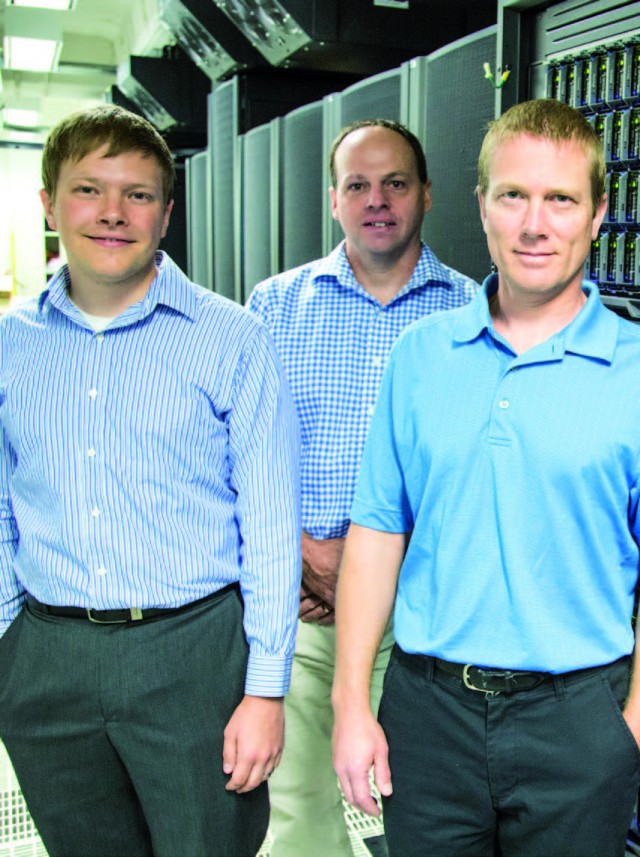

# Better storm surge modeling using high performance computing

When hurricanes or tropical storms head toward the North Carolina coast, RENCI’s Dell PowerEdge cluster, called Hatteras, springs into action, producing finely-detailed models of possible storm tracks and resulting coastal storm surge several times a day.

===

A recent upgrade to Hatteras means more capacity to produce  a large number of storm surge forecast ensembles and high-resolution models in less than three hours. The effort to upgrade Hatteras was documented in a recent case study developed by Dell.

[Read the case study.](http://renci.org/wp-content/uploads/2014/08/2014_RENCI_Dell-CaseStudy.pdf)

For more on RENCI’s coastal modeling work, see [Coastal Hazards Modeling](http://renci.org/research/coastal-hazards-modeling/) web page.