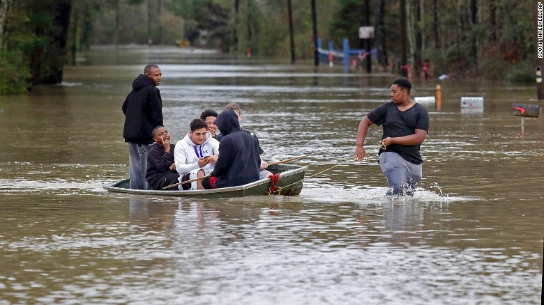

# HydroShare extends the reach of breakthrough National Water Model

The national water science community has been abuzz since August, when the National Oceanic and Atmospheric Administration (NOAA) launched its new high resolution National Water Model (NWM), a system that simulates the flow of rivers and streams throughout the continental United States in more detail than ever before possible.

===

Using data from more than 8,000 U.S. Geological Service stream gauges and other sources, the NWM can produce water flow forecasts to 2.7 million stream locations and provides high resolution forecasts of stream flows, soil moisture levels, water runoff, stream anomalies, and other parameters at 700 times greater detail than the previous model. The NWM gives scientists a wealth of data to help them better understand hydrological processes. That same data can help communities and emergency responders better prepare for and mitigate floods that take lives and damage homes and businesses every year.

The NWM simulates the water cycle by modeling a host of different complex processes that cause water levels to change, such as snow melt, water movement through soil levels, changing elevations, soil and vegetation types, and precipitation rates. The model runs on National Science Foundation-funded supercomputers, producing hourly simulations of current conditions as well as medium-range and 30 day forecasts.

If you look under the hood, the work of RENCI and its HydroShare collaborators have played an important role in disseminating the NWM forecasts and their underlying data to the experts who need it most.

## Sharing with a broad community of scientists

To help make the NWM forecasts more accessible to scientists and the public, NWM data is ingested and stored daily on a secure server at RENCI. RENCI mirrors the NWM output in NOAA’s National Operational Model Archive and Distributed System (NOMADS) and shares the data with the broad water science community through HydroShare. Launched in 2012, HydroShare is an open source water science research and discovery environment that allows scientists and the public to access, visualize, and manipulate a broad set of hydrologic data types and models, and connect with data and models published by others.

The HydroShare research team, led by David Tarboton of Utah State University, includes collaborators from RENCI, Brigham Young University, the University of North Carolina Institute for the Environment, Purdue University, the Consortium of Universities for the Advancement of Hydrologic Science Inc., (CUAHSI), Caktus Group, Tufts University, the University of Texas at Austin, University of Virginia, and the University of Washington.

Michael Stealey, RENCI DevOps lead for HydroShare, created a system that captures the NWM outputs and stores them at RENCI using the integrated Rule-Oriented Data System (iRODS), the open source data management platform developed and sustained by the iRODS Consortium at RENCI. Hong Yi, RENCI software lead for HydroShare, then created an environment within HydroShare using iRODS that makes the NWMs and similar valuable community data available through HydroShare in a federated data grid, which enables users to easily manage, archive and share this important water science data.

HydroShare includes several embedded apps that enable users to get the most out of the NWM data, including:
* The NWM Forecast Viewer, which visualizes channel, reservoir, and land type forecasts for the different configurations of the NWM and all of the variables within its output files.
* The NWM Forecast Explorer, which uses filters to search for and discover individual forecast files and entire sets of forecasts located in RENCI’s data storage directories.

“The National Water Model is an example of big data that can immediately be put to use to serve the public good,” said Ray Idaszak, a co-principal investigator on the HydroShare Project and director of collaborative environments at RENCI.

Indeed, the potential benefits of the model are undeniable; floods killed more people last year than any other weather hazard, according to the NSF. Most recently, flooding in Louisiana took the lives of more than a dozen people and damaged more than 40,000 homes.

“The new model illustrates the achievements that are possible when you combine the knowledge of water scientists with advanced technologies and cyberinfrastructure,” Idaszak continued. “The scientists and practicing hydrologists know what information they need, but it takes top-tier high performance computing resources, robust data management, and tools that enable easy visualization and analysis on the desktop to turn a model into an easily used tool. The entire HydroShare team is proud of our role in bringing this model to the public.”