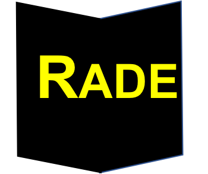

# Risk Analytics Discovery Environment (RADE)

This projects leverages a suite of technology integrated by RENCI to deploy the CyVerse Discovery Environment to support a pilot science as a service platform for risk analytics. The platform enables data management and sharing, creating analytical applications, and accessing high performance computing. his project is part of the joint NCDSA project led by UNCC, with NCSU and RENCI as partners.
