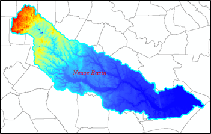

# North Carolina Flood Forecast Pilot

Working with experts at the UNC Institute for the Environment, RENCI EDS is working on a pilot flood forecast effort. This pilot, funded through the North Carolina Policy Collaboratory, leverages the availability of high resolution LIDAR data for North Carolina, the HAND model for flood modeling, and data from NOAA's National Water Model (NWM). The goal of the project is to evaluate the potential for the outputs from the pilot to be used by decision-makers and first responders across the state.
